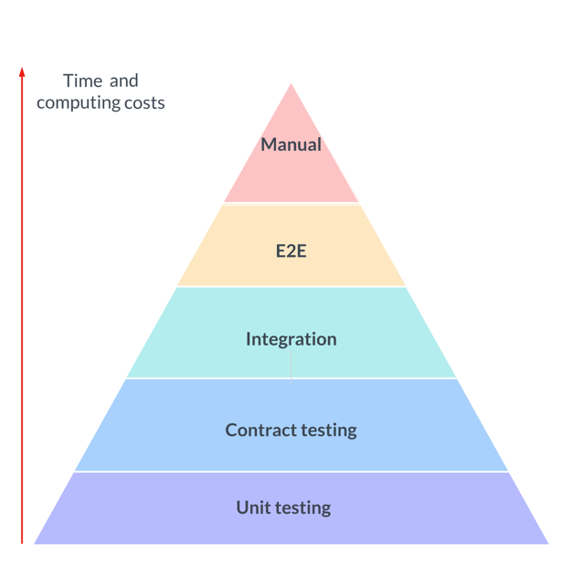

# Welcome to your Testing on CDK Project

You should explore the contents of this project. 
It shows a simple implementation of the test pyramid for a IaC project. 

## Useful commands

* `npm run build`             compile typescript to js
* `npm run watch`             watch for changes and compile
* `npm run unit-test`         perform the jest unit tests
* `npm run contract-test`     perform the jest unit tests
* `npm run integration-test`  perform the jest unit tests
* `npm run e2e-test`          perform the jest unit tests
* `cdk deploy`                deploy this stack to your default AWS account/region
* `cdk diff`                  compare deployed stack with current state
* `cdk synth`                 emits the synthesized CloudFormation template
